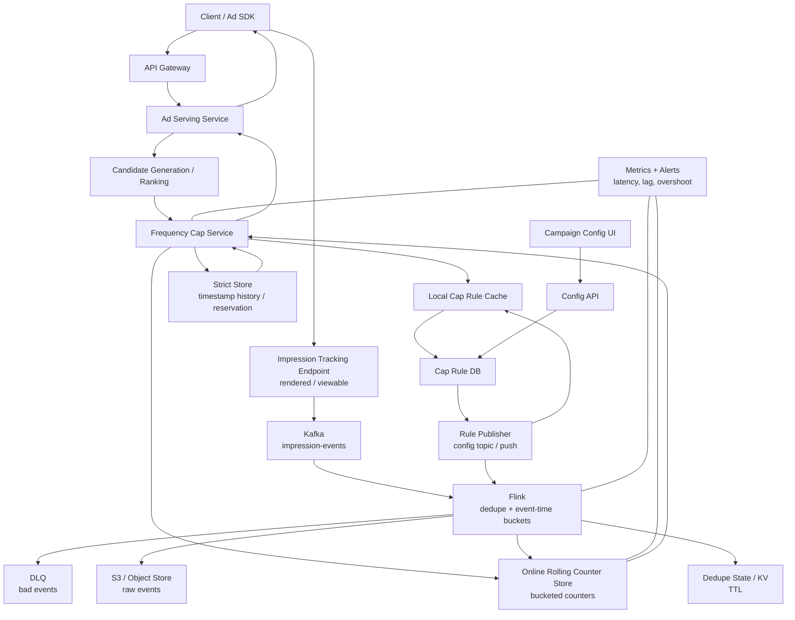

# Design an Ad Frequency Capping System

This document is written as a 60-minute system design walkthrough. It is optimized for an onsite interview where the interviewer expects clear requirements, scale estimates, API and data models, read/write paths, rolling-window tradeoffs, and distributed-systems failure handling.

## 0. Interview Framing

Opening statement:

> I would separate this system into a low-latency online decision path and a durable asynchronous impression-counting path. The online path answers whether a candidate ad is eligible right now. The write path records real impressions, deduplicates them, updates rolling-window counters, and keeps raw events for replay and audit. The main tradeoff is exactness versus latency and availability, especially for rolling windows and multi-region serving.

The problem is not to design the entire ad platform. I will assume upstream systems already exist:

* Campaign Service
* Ad Catalog Service
* Targeting Service
* Candidate Generation Service
* Ranking / Auction / Pacing systems

This design focuses on:

* cap definitions
* online cap checks
* impression events
* rolling-window counters
* deduplication
* replay and retention
* strict versus best-effort enforcement

## 1. Clarifying Questions

Ask these first:

* What is the ad-serving QPS and p99 latency budget for cap checks?
* How many candidate ads do we cap-check per request?
* How many cap rules can apply to one candidate ad?
* Are windows rolling or calendar-aligned?
* Is small bounded overshoot acceptable, or do some campaigns require exact enforcement?
* Is serving single-region or active-active multi-region?
* Should the system fail open or fail closed if the cap store is unavailable?
* What counts as an impression: selected, rendered, or viewable?
* How late can impression events arrive?
* How long do we retain raw events for audit and backfill?

Assumptions for this design:

* High-QPS ad platform.
* p99 cap-check latency target: 3-10 ms.
* Candidate generator may return 50 candidates; we cap-check top 20 after coarse ranking.
* Each candidate has 2-4 cap rules.
* The required window is rolling, not calendar-based.
* Default campaigns allow small bounded overshoot.
* Strict campaigns opt into exact enforcement with higher cost.
* Serving is active-active across regions.

## 2. Functional Requirements

Core requirements:

* Before an ad is shown, decide whether a candidate ad, ad group, campaign, advertiser, or household-scoped campaign is eligible.
* Support rolling caps of the form: at most `N` impressions during the last `W` time units.
* Support multiple cap scopes:
  * user-ad
  * user-ad-group
  * user-campaign
  * user-advertiser
  * household-campaign
  * device-ad, if needed
* Multiple caps can apply to the same candidate ad. If any cap fails, the candidate is ineligible.
* Count actual impressions after the ad is rendered or viewable, not just selected.
* Support best-effort and strict enforcement modes.
* Deduplicate duplicate impression events and duplicate client retries.
* Handle delayed and out-of-order impression events.
* Retain raw event history for replay, audit, and analytics.

Out of scope:

* Full campaign/ad/targeting schema.
* Auction and bidding.
* Budget pacing.
* Fraud detection.
* Identity graph construction for household mapping.

## 3. Non-functional Requirements

Latency:

* Cap check is on the critical path of ad serving.
* p99 latency should be single-digit milliseconds where possible.
* Batch reads are required; avoid one remote call per cap key.

Throughput:

* Support high ad request QPS and high impression event QPS.
* Stream processing must keep up with peak event ingestion.

Availability:

* Best-effort campaigns should generally fail open if cap checks are unavailable.
* Strict campaigns can fail closed.
* System must degrade predictably under counter-store or stream-processor failures.

Correctness:

* Best-effort mode accepts bounded overshoot.
* Strict mode should prevent overshoot with atomic check-and-add or reservation.
* Impression updates must be idempotent.

Scalability:

* Partition by user/scope/campaign keys.
* Avoid unbounded per-request read fanout.
* Support hot campaign and hot household/user scenarios.

Operability:

* Monitor cap-check latency, overshoot rate, event lag, dedupe rate, counter-store errors, and replay health.

## 4. Traffic Estimation

Example assumptions:

* 50 million ad-supported daily active users.
* 20 ad opportunities per active user per day.
* 1 billion ad requests per day.
* Average ad request QPS: `1B / 86,400 ~= 11.6K QPS`.
* Peak factor: 10x.
* Peak ad request QPS: `~116K QPS`.

Candidate fanout:

* Candidate generation returns 50 ads.
* We cap-check top 20 candidates.
* Average 3 cap rules per candidate.
* Logical counter checks per ad request: `20 * 3 = 60`.
* Peak logical key reads: `116K * 60 ~= 7M keys/sec`.

This does not mean 7M network calls/sec. The service must:

* batch key reads
* cache cap rules locally
* cap-check only a bounded number of candidates
* optionally precompute or cache hot eligibility state

Impression volume:

* Assume 80% of ad requests result in rendered/viewable impressions.
* Daily impressions: `1B * 0.8 = 800M`.
* Average impression event QPS: `800M / 86,400 ~= 9.3K QPS`.
* Peak impression event QPS: `~93K QPS`.

Counter writes:

* Each impression updates about 3 cap counters.
* Daily counter increments: `800M * 3 = 2.4B`.
* Peak counter increments: `93K * 3 ~= 279K increments/sec`.

Raw event storage:

* Average event size: 0.5-1 KB.
* Raw event volume: `800M * 1 KB ~= 800 GB/day` before compression.
* Object storage retention can reach hundreds of TB depending on retention period.

## 5. Rolling Window Versus Calendar Window

Calendar window example:

```text
At most 3 impressions per UTC day.
```

Key:

```text
fc:USER_AD:u123:ad456:day:2026-06-29
```

Pros:

* Very cheap read: one counter per cap.
* Easy TTL.
* Easy aggregation.

Cons:

* Boundary artifact. A user can see 3 ads at 23:59 and 3 more at 00:01.
* Does not satisfy "last W units of time."

Rolling window example:

```text
At most 3 impressions in the last 24 hours.
```

Pros:

* Better user experience.
* Matches the stated requirement exactly.

Cons:

* More expensive.
* Requires either multiple time buckets or timestamp history.
* Harder to make exact under concurrency.

## 6. Rolling Window Implementation Options

### Option A: Bucketed Rolling Counters

This is the default high-QPS design.

For each cap key, split time into fixed-size buckets. A 24-hour window might use 5-minute, 15-minute, or 1-hour buckets.

Example:

```text
rule: user u123 may see ad ad456 at most 3 times in last 24h
bucket size: 1 hour

fc:USER_AD:u123:ad456:bucket:2026-06-29T10
fc:USER_AD:u123:ad456:bucket:2026-06-29T11
...
```

Read path:

```text
window_start = now - W
buckets = all bucket IDs overlapping [window_start, now]
count = sum(counter[bucket] for bucket in buckets)
if count >= limit:
    block
else:
    allow
```

Write path:

```text
bucket = floor(event_time / bucket_size)
INCR bucket counter
EXPIRE bucket after W + grace_period
```

Tradeoff:

* Smaller buckets improve accuracy but increase read fanout.
* Larger buckets reduce fanout but increase boundary error.

Example:

```text
24h window, 1h buckets: 24 bucket reads per cap
24h window, 5m buckets: 288 bucket reads per cap
7d window, 1h buckets: 168 bucket reads per cap
```

Optimizations:

* Use coarser buckets for long windows.
* Maintain rolling aggregate per cap key when writes arrive.
* Read only top N candidates.
* Batch all bucket reads for all candidates.
* Cache hot counts for a short TTL.

Accuracy:

* This can be approximate near bucket boundaries.
* If the system counts full buckets that overlap the window, it may overcount and block slightly early.
* If it ignores partial buckets, it may undercount and allow small overshoot.
* For ads, conservative overcount is often acceptable because it protects user experience.

### Option B: Timestamp History

This is the exact rolling-window data model.

For each scope key, store recent impression timestamps.

Example using Redis sorted set:

```text
hist:USER_AD:u123:ad456

member = event_id or request_id:ad_id:placement_id
score = event_time_epoch_ms
```

Read path:

```text
ZREMRANGEBYSCORE key -inf now-W
count = ZCOUNT key now-W now
if count >= limit:
    block
else:
    allow
```

Strict path:

```text
ZREMRANGEBYSCORE key -inf now-W
count = ZCARD key
if count < limit:
    ZADD key now reservation_or_request_id
    EXPIRE key W + grace
    allow
else:
    block
```

The strict path must run atomically, for example in a Lua script or strongly consistent transaction.

Pros:

* Exact rolling window.
* Natural dedupe if event ID is the sorted-set member.
* Good for low-volume strict campaigns.

Cons:

* More memory per impression.
* Hot keys can become expensive.
* Atomic check-and-add increases latency.
* Multi-region exactness requires coordination or user home-region routing.

### Recommended Hybrid

Use bucketed rolling counters for normal high-QPS campaigns:

```text
best-effort, scalable, low-latency, bounded error
```

Use timestamp history or reservation for strict campaigns:

```text
exact, more expensive, lower availability
```

Interview line:

> Rolling windows are first-class in this design. For normal traffic, I use bucketed counters because they keep writes cheap and reads bounded. For exact caps, I use atomic timestamp history or reservations, accepting higher latency and stronger coordination.

## 7. API Design

### 7.1 Check Caps

Internal API called by Ad Serving Service.

```http
POST /v1/frequency-caps/check
```

Request:

```json
{
  "request_id": "req_123",
  "user": {
    "user_id": "u_123",
    "household_id": "hh_456",
    "device_id": "dev_789"
  },
  "region": "us-east-1",
  "placement_id": "pre_roll",
  "request_time": "2026-06-29T12:00:00Z",
  "candidates": [
    {
      "ad_id": "ad_1",
      "ad_group_id": "ag_1",
      "campaign_id": "camp_1",
      "advertiser_id": "adv_1"
    }
  ]
}
```

Response:

```json
{
  "request_id": "req_123",
  "results": [
    {
      "ad_id": "ad_1",
      "eligible": true,
      "failed_caps": []
    },
    {
      "ad_id": "ad_2",
      "eligible": false,
      "failed_caps": [
        {
          "cap_rule_id": "rule_456",
          "scope": "USER_CAMPAIGN",
          "current_count": 10,
          "limit": 10
        }
      ]
    }
  ]
}
```

Notes:

* Batch candidates in one request.
* Use local cap-rule cache.
* Build all counter keys in memory.
* Batch counter reads from the online store.
* Return only decision-critical information.

### 7.2 Record Impression

Called by tracking pixel, server-side renderer, or client SDK after the ad is rendered or viewable.

```http
POST /v1/impressions
```

Request:

```json
{
  "event_id": "imp_evt_abc",
  "request_id": "req_123",
  "user_id": "u_123",
  "household_id": "hh_456",
  "device_id": "dev_789",
  "ad_id": "ad_1",
  "ad_group_id": "ag_1",
  "campaign_id": "camp_1",
  "advertiser_id": "adv_1",
  "placement_id": "pre_roll",
  "event_time": "2026-06-29T12:00:03Z",
  "ingest_time": "2026-06-29T12:00:04Z",
  "region": "us-east-1",
  "render_state": "VIEWABLE",
  "cap_config_version": 17
}
```

Response:

```json
{
  "accepted": true
}
```

Notes:

* The tracking endpoint should write to Kafka before acknowledging.
* It should not synchronously update every counter on the request path.
* Counter updates happen in Flink.

### 7.3 Configure Cap Rules

Campaign management API.

```http
PUT /v1/campaigns/{campaign_id}/frequency-caps
```

Request:

```json
{
  "rules": [
    {
      "scope_type": "USER_AD",
      "limit": 3,
      "window_type": "ROLLING",
      "window_size_seconds": 86400,
      "bucket_size_seconds": 300,
      "strictness": "BEST_EFFORT",
      "fail_mode": "FAIL_OPEN"
    },
    {
      "scope_type": "USER_CAMPAIGN",
      "limit": 10,
      "window_type": "ROLLING",
      "window_size_seconds": 604800,
      "bucket_size_seconds": 3600,
      "strictness": "BEST_EFFORT",
      "fail_mode": "FAIL_OPEN"
    }
  ]
}
```

## 8. Data Models

### 8.1 Cap Rule Store

This can live in a relational DB or strongly consistent metadata store because writes are low QPS and correctness matters.

Table: `cap_rules`

| Column | Type | Notes |
|---|---|---|
| cap_rule_id | string | primary key |
| campaign_id | string | indexed |
| ad_group_id | string nullable | optional ad-group scope |
| ad_id | string nullable | optional ad scope |
| advertiser_id | string nullable | optional advertiser scope |
| scope_type | enum | USER_AD, USER_AD_GROUP, USER_CAMPAIGN, USER_ADVERTISER, HOUSEHOLD_CAMPAIGN |
| limit | int | max impressions |
| window_type | enum | ROLLING, CALENDAR_DAY, CALENDAR_WEEK |
| window_size_seconds | int | rolling window size |
| bucket_size_seconds | int nullable | for bucketed rolling counters |
| strictness | enum | BEST_EFFORT, STRICT |
| fail_mode | enum | FAIL_OPEN, FAIL_CLOSED |
| status | enum | ACTIVE, PAUSED, DELETED |
| version | int | config version |
| start_at | timestamp | effective start |
| end_at | timestamp nullable | effective end |
| updated_at | timestamp | audit |

Sample data:

| cap_rule_id | campaign_id | ad_id | scope_type | limit | window_type | window_size_seconds | bucket_size_seconds | strictness |
|---|---|---|---|---:|---|---:|---:|---|
| rule_001 | camp_100 | ad_9001 | USER_AD | 3 | ROLLING | 86400 | 300 | BEST_EFFORT |
| rule_002 | camp_100 | null | USER_CAMPAIGN | 10 | ROLLING | 604800 | 3600 | BEST_EFFORT |
| rule_003 | camp_100 | null | HOUSEHOLD_CAMPAIGN | 20 | ROLLING | 604800 | 3600 | BEST_EFFORT |
| rule_004 | camp_200 | null | USER_CAMPAIGN | 2 | ROLLING | 3600 | null | STRICT |

### 8.2 Bucketed Counter Store

Store options:

* Redis Cluster
* Aerospike
* DynamoDB
* Cassandra

Key format:

```text
fc:{scope_type}:{scope_id}:{entity_type}:{entity_id}:b:{bucket_start_epoch}
```

Examples:

```text
fc:USER_AD:u_123:ad:ad_9001:b:1782744000
fc:USER_CAMPAIGN:u_123:campaign:camp_100:b:1782744000
fc:HOUSEHOLD_CAMPAIGN:hh_456:campaign:camp_100:b:1782744000
```

Value:

```json
{
  "count": 4,
  "last_updated_at": "2026-06-29T12:00:03Z"
}
```

TTL:

```text
window_size + lateness_grace + safety_buffer
```

Example:

```text
24h rolling window + 6h late-arrival grace => TTL around 30h
7d rolling window + 1d late-arrival grace => TTL around 8d
```

### 8.3 Timestamp History Store

Used for strict or low-volume exact caps.

Redis sorted set example:

```text
key: hist:USER_CAMPAIGN:u_123:campaign:camp_200
score: event_time_epoch_ms
member: request_id or event_id
```

Operations:

```text
trim old impressions
count recent impressions
add new impression/reservation if below limit
expire key after W + grace
```

### 8.4 Dedupe Store

Purpose:

* Prevent duplicate client retries or Flink replays from double-incrementing counters.

Key examples:

```text
dedupe:event:{event_id}
dedupe:request:{request_id}:ad:{ad_id}:placement:{placement_id}
```

Value:

```json
{
  "first_seen_at": "2026-06-29T12:00:04Z",
  "event_time": "2026-06-29T12:00:03Z"
}
```

TTL:

* Should exceed expected retry and lateness window.
* Common range: 1-7 days.

Design note:

* If event IDs are globally unique and stable, use `event_id`.
* If clients may regenerate event IDs on retry, use an idempotency key such as `request_id + ad_id + placement_id`.

### 8.5 Kafka Event Schema

Topic:

```text
impression-events
```

Event:

```json
{
  "event_id": "imp_evt_abc",
  "request_id": "req_123",
  "user_id": "u_123",
  "household_id": "hh_456",
  "device_id": "dev_789",
  "ad_id": "ad_1",
  "ad_group_id": "ag_1",
  "campaign_id": "camp_1",
  "advertiser_id": "adv_1",
  "placement_id": "pre_roll",
  "event_time": "2026-06-29T12:00:03Z",
  "ingest_time": "2026-06-29T12:00:04Z",
  "region": "us-east-1",
  "render_state": "VIEWABLE",
  "cap_config_version": 17
}
```

Partitioning:

* Partition by `user_id` or a hash of the cap scope key.
* Partitioning by user improves locality for user-scoped dedupe and ordering.
* The design should not require total ordering because delayed and out-of-order events are expected.

### 8.6 Raw Event Store

Store:

* S3 or another object store.

Path:

```text
s3://ad-events/impressions/dt=2026-06-29/hour=12/region=us-east-1/
```

Why store raw events:

* Kafka is not a permanent database.
* Online counters expire and are not auditable event history.
* Raw events are needed for replay, backfill, reporting, billing reconciliation, ML, and cap-violation investigations.

## 9. Read Path

Step-by-step:

1. Client triggers an ad opportunity.
2. Ad Serving Service calls Candidate Generation / Ranking.
3. Candidate service returns candidate ads with `ad_id`, `ad_group_id`, `campaign_id`, and `advertiser_id`.
4. Ad Serving sends top N candidates to Frequency Cap Service.
5. Frequency Cap Service loads cap rules from local rule cache.
6. For each candidate, generate all cap keys.
7. For bucketed rolling windows, generate all relevant bucket keys.
8. Batch-read counters from the online store.
9. Sum buckets per cap rule.
10. If any cap count is greater than or equal to the limit, mark the candidate ineligible.
11. Return eligibility results to Ad Serving.
12. Ad Serving chooses from eligible candidates.

Pseudo-code:

```python
def check_caps(user, candidates, now):
    rules_by_campaign = rule_cache.get_many([c.campaign_id for c in candidates])
    read_keys = []
    checks = []

    for candidate in candidates:
        for rule in rules_by_campaign[candidate.campaign_id]:
            scope_id = build_scope_id(rule.scope_type, user)
            entity_id = build_entity_id(rule.scope_type, candidate)
            bucket_keys = build_bucket_keys(rule, scope_id, entity_id, now)
            read_keys.extend(bucket_keys)
            checks.append((candidate.ad_id, rule, bucket_keys))

    values = counter_store.batch_get(read_keys)

    results = {}
    for ad_id, rule, bucket_keys in checks:
        count = sum(values.get(k, 0) for k in bucket_keys)
        if count >= rule.limit:
            results[ad_id] = "BLOCKED"

    return results
```

Latency controls:

* Limit candidates checked.
* Batch keys.
* Cache rule config.
* Avoid large bucket fanout for long windows.
* Apply timeouts and fail-mode logic.

## 10. Write Path with Kafka and Flink

Step-by-step:

1. Ad is rendered or viewable.
2. Client SDK or server-side tracker sends impression event.
3. Tracking endpoint validates required fields.
4. Tracking endpoint writes event to Kafka.
5. Flink consumes from Kafka.
6. Flink deduplicates events.
7. Flink assigns event-time bucket based on `event_time`.
8. Flink loads cap rules, preferably from broadcast state or a compacted config topic.
9. Flink emits counter increment operations.
10. Counter store applies idempotent increments or dedup-protected increments.
11. Flink writes raw events to S3/object storage.
12. DLQ captures malformed or permanently failing events.

Flink responsibilities:

* Use event time, not processing time, for bucket assignment.
* Handle out-of-order events with watermarks.
* Keep dedupe state for a bounded TTL.
* Use checkpointing to recover from failures.
* Write counter updates in an idempotent or effectively-once way.

Flink topology:

```text
Kafka impression-events
  -> parse/validate
  -> keyBy(dedupe_key)
  -> dedupe with state TTL
  -> keyBy(cap_scope_key)
  -> assign bucket from event_time
  -> enrich with cap rules
  -> write counter increments
  -> sink raw events to S3
  -> DLQ invalid events
```

Flink event-time handling:

* `event_time` determines the rolling-window bucket.
* `ingest_time` is used for lag and debugging.
* Watermark allows bounded lateness, for example 10 minutes or 1 hour.
* Events later than the allowed lateness can still be stored in S3, but may not update online counters if their bucket TTL has expired.

## 11. Dedupe Design

There are three common duplicate sources:

* Client retry after timeout.
* Tracking pixel fires twice.
* Kafka/Flink retry or replay after failure.

Preferred idempotency key:

```text
request_id + ad_id + placement_id
```

This is often better than client-generated `event_id` because a retry may create a new event ID.

Alternative:

```text
event_id
```

Good if generated server-side and stable.

Flink dedupe:

```text
keyBy(dedupe_key)
if dedupe_key exists in state:
    drop event
else:
    store dedupe_key with TTL
    pass event downstream
```

State TTL:

* Must cover expected retry and replay window.
* If Kafka can replay 24 hours and client retries can happen for hours, use at least 24-48 hours.

Counter-store dedupe:

* For stronger protection, counter increments can also include a dedupe key.
* Example: maintain a small `seen` set per event or use an external dedupe KV before incrementing.

Tradeoff:

* Flink state dedupe is fast and scalable.
* External dedupe is safer across full job restarts or state loss.
* For most systems, Flink checkpointed state plus raw-event replay is enough for effectively-once processing.

Important interview phrase:

> I would not claim perfect exactly-once end-to-end. I would design for effectively-once updates with stable idempotency keys, checkpointed stream state, and replayable raw events.

## 12. Race Conditions and Strict Enforcement

Best-effort path:

```text
check count
serve ad
later increment count
```

Race:

```text
cap limit = 3
current count = 2
request A reads 2 and passes
request B reads 2 and passes
both render
final count = 4
```

This is acceptable only if bounded overshoot is allowed.

Mitigations:

* fast counter updates
* sticky routing by user
* safety margin near cap
* short-lived local negative cache when cap reached
* strict path for sensitive campaigns

Strict path using atomic timestamp history:

```text
atomic:
  remove entries older than now-W
  count current entries
  if count < limit:
      add reservation/request id with timestamp
      allow
  else:
      block
```

Strict path using reservation:

```text
reserve slot before serving
if rendered:
    confirm reservation
else:
    release reservation
if no callback:
    reservation expires by TTL
```

Reservation state:

| Field | Notes |
|---|---|
| reservation_id | unique id |
| cap_key | scope + entity + window |
| request_id | original ad request |
| status | RESERVED, CONFIRMED, RELEASED, EXPIRED |
| expires_at | TTL for leaked reservations |
| created_at | audit |

Invariant:

```text
confirmed_count + active_reserved_count <= limit
```

Cost:

* Higher p99 latency.
* Extra write before serving.
* More contention on hot users/campaigns.
* Harder multi-region correctness.
* Requires cleanup of leaked reservations.

## 13. Failures and Recovery

Counter store timeout:

* Best-effort campaign: fail open, log decision.
* Strict campaign: fail closed or route to strict reservation service.
* Alert on timeout rate.

Kafka unavailable:

* Tracking endpoint can retry briefly.
* If Kafka is unavailable, either fail the tracking request or buffer locally with strong limits.
* Do not silently drop impressions if billing/audit depends on them.

Flink lag:

* Detection:
  * consumer lag
  * watermark lag
  * event_time to processing_time lag
  * checkpoint duration
* Serving degradation:
  * apply safety margin
  * reduce effective cap
  * fail closed for strict campaigns
* Recovery:
  * scale Flink workers
  * replay Kafka offsets
  * backfill from S3 if Kafka retention is insufficient

Duplicate events:

* Deduplicate by stable idempotency key.
* Use checkpointed Flink state with TTL.
* Optionally use external dedupe KV.

Delayed events:

* Use event-time bucket.
* Keep bucket TTL longer than the window.
* Very late events may go to S3-only for audit if online counters have expired.

Out-of-order events:

* Counter increments are commutative.
* Window assignment uses event timestamp.
* No global ordering assumption.

Selected but not rendered:

* Best-effort path increments only after render/viewability event.
* Strict path uses reservation and releases/expirs unrendered slots.

## 14. Multi-region Design

Default:

* Each region has local Frequency Cap Service and local counter store.
* Serving uses local reads for latency.
* Kafka events replicate asynchronously.
* Counters converge eventually.

Overshoot causes:

* Same user served concurrently from multiple regions.
* Cross-region replication lag.
* Multi-device household traffic.
* Flink lag.

Mitigations:

* Sticky route user/household to home region.
* Split campaign quota across regions.
* Fast async replication.
* Conservative safety margin.
* Strict campaigns route to a single owner region or globally consistent store.

Tradeoff:

```text
local counters: low latency, high availability, possible overshoot
global strong consistency: exact, higher latency, lower availability
```

## 15. Data Retention

Online counters:

* Retain for `window + lateness_grace + safety_buffer`.
* TTL makes storage bounded.

Dedupe state:

* Retain for expected retry/replay period.
* Usually 1-7 days depending on product guarantees.

Kafka:

* Retain enough for operational replay, often days.
* Kafka is not the permanent event archive.

S3 raw events:

* Retain for months or years depending on billing, compliance, and analytics needs.
* Partition by date/hour/region.
* Used for audit, backfill, analytics, and ML.

## 16. Metrics and Alerts

Serving metrics:

* cap_check_latency_p50/p95/p99
* cap_check_timeout_rate
* candidates_checked_per_request
* counter_keys_read_per_request
* fail_open_count
* fail_closed_count

Correctness metrics:

* cap_violation_rate
* overshoot_count_per_rule
* false_allow_rate
* false_block_rate
* strict_reservation_leak_count

Pipeline metrics:

* impression_event_ingest_qps
* Kafka consumer lag
* Flink watermark lag
* Flink checkpoint duration
* dedupe_drop_rate
* counter_update_success_rate
* DLQ size

Multi-region metrics:

* replication_lag_seconds
* regional_counter_divergence
* per-region overshoot rate

Business metrics:

* ad_fill_rate
* cap-filtered candidate rate
* campaign delivery impact
* revenue impact from strict mode
* user ad fatigue score

## 17. Diagram



## 18. 60-minute Walkthrough Plan

Minute 0-5: Clarify requirements

* Confirm rolling window.
* Confirm cap scopes.
* Confirm latency and QPS.
* Confirm best-effort versus strict correctness.
* Confirm fail-open/fail-closed policy.

Minute 5-10: Functional and non-functional requirements

* State what is in scope and out of scope.
* Emphasize this is not full ad-platform design.

Minute 10-15: Traffic estimation

* Estimate ad request QPS.
* Estimate candidate fanout.
* Estimate logical counter reads.
* Estimate impression event QPS.
* Estimate counter write volume.

Minute 15-25: High-level architecture

* Draw read path.
* Draw write path.
* Explain why they are separated.
* Explain Kafka, Flink, online counter store, S3, rule cache.

Minute 25-35: Rolling-window data model

* Compare calendar and rolling windows.
* Present bucketed rolling counters.
* Discuss bucket size tradeoff.
* Present timestamp history for strict exact caps.
* Explain hybrid recommendation.

Minute 35-42: APIs and schemas

* Cap-check API.
* Impression API.
* Cap-rule schema.
* Counter key format.
* Kafka event schema.
* Dedupe schema.

Minute 42-50: Correctness and failures

* Duplicate requests.
* Out-of-order events.
* Flink lag.
* Race condition under concurrent serving.
* Strict path and reservations.
* Selected but not rendered.

Minute 50-55: Multi-region and scaling

* Local counters versus global consistency.
* Sticky routing.
* Regional quota split.
* Hot keys and sharding.

Minute 55-60: Wrap-up

* Summarize tradeoffs.
* Call out metrics.
* Explain what changes at 100x scale or exact enforcement.

## 19. Final Interview Summary

Best final answer:

> I would build a Frequency Cap Service on the serving path with a local rule cache and a low-latency rolling counter store. The serving path batch-checks top candidate ads against all applicable caps. The write path records rendered impressions to Kafka, then Flink deduplicates events, assigns event-time buckets, updates counters, and archives raw events to S3 for replay and audit. For high-volume campaigns, bucketed rolling counters provide low latency with bounded approximation. For strict exact caps, I would use atomic timestamp history or reservation-based enforcement, accepting higher latency and lower availability. The main operational risks are race conditions, duplicate events, Flink lag, hot keys, counter-store outages, and multi-region inconsistency.
