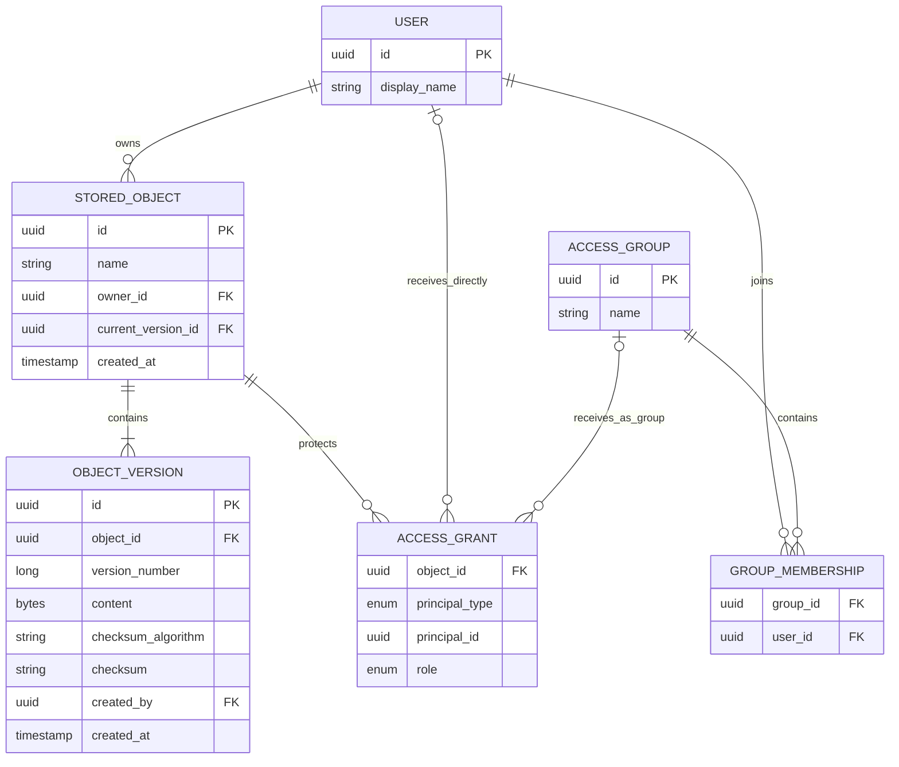

# Simple Object Storage

A focused backend project for modeling immutable object versions, role-based
access, and checksum-based duplicate discovery.

The goal is not to reproduce a commercial cloud storage product. It is to build
the smallest system that makes the important data-modeling decisions explicit,
testable, and defensible under scale.

## Status

Design in progress. The Java directory contains a framework-free source and test
package skeleton modeled after the repository's other Java modules. The domain
model and tests have not been implemented yet.

## Problem

Store objects with:

- a stable identifier;
- a human-readable name;
- exactly one owner;
- immutable content versions;
- a checksum for each version;
- object-scoped access roles.

Users must be able to discover every object they can access. Authorized users must
also be able to discover who can access a given object without embedding an
unbounded user list inside the object record.

## Requirements

### Object lifecycle

- Create an object with its first version.
- Read an object or a specific historical version.
- Edit content by appending a new version; existing versions never change.
- Retain version history so any previous state can be read.
- Find possible duplicate content by checksum.

### Access roles

Roles are scoped to an object:

| Role | Capabilities |
| --- | --- |
| `VIEWER` | Read object metadata and content. |
| `EDITOR` | All viewer capabilities and append a new version. |
| `ADMIN` | All editor capabilities, manage access, and search for duplicate content. |

The owner is separate from the access role. Ownership is singular and stable in
the first version of this project; ownership transfer is out of scope.

### Access queries

- List all objects accessible to a user, with pagination.
- List the users or groups that can access an object, with pagination.
- Resolve both direct user grants and grants inherited through groups.

## Scope

Assume an effectively unbounded backing disk. Bucket hierarchy, directories,
physical file paths, replication, multipart upload, storage placement, and blob
transport are intentionally out of scope. The implementation may keep small
content values in-process while the module focuses on metadata and authorization.

Authentication is also out of scope. APIs receive an already authenticated user
identifier and perform authorization.

This is an object-oriented design exercise, not a web-service implementation.
Spring, database adapters, dependency injection frameworks, and build-tool
configuration are unnecessary for the core solution. Persistence and HTTP API
sections below describe system boundaries and query implications rather than
required implementation work.

## Proposed domain model



`ACCESS_GRANT.principal_id` refers to either a user or a group according to
`principal_type`. The application must validate that the referenced principal
exists because a conventional foreign key cannot enforce a polymorphic reference.
If that tradeoff becomes undesirable, direct-user grants and group grants can be
split into separate tables.

## Key decisions

### A version is the snapshot

There is no separate `Snapshot` entity. Each `OBJECT_VERSION` is an immutable
snapshot of one object at one point in time. Introducing another entity would
duplicate identity and lifecycle without adding behavior.

The relationship points from versions to their logical object. The object record
does not own an in-memory list of every version. `current_version_id` is a
convenient read pointer; appending a version inserts a new row and advances this
pointer in one transaction.

### Access is a relation, not an object field

An object does not contain `List<User>`. Access is a many-to-many relationship
represented by grants. Groups reduce repeated grants for users who share the same
policy, while direct grants preserve exceptions.

At large scale, listing a billion object records and filtering them in application
memory is not viable. Access queries start from the requesting user's direct
principal plus group memberships, then use indexed grant records to find object
identifiers. The reverse query starts from the object identifier and expands its
granted principals only when needed.

Initial relational indexes:

- `UNIQUE (object_id, version_number)` on versions;
- `(checksum_algorithm, checksum)` on versions;
- `UNIQUE (group_id, user_id)` and `(user_id, group_id)` on memberships;
- `UNIQUE (object_id, principal_type, principal_id)` on grants;
- `(principal_type, principal_id, object_id)` for user-to-object lookup;
- `(object_id, principal_type, principal_id)` for object-to-principal lookup.

At much larger scale, grants can be partitioned by principal for the primary
"objects accessible to this user" query. If both query directions must remain
fast, separate materialized access indexes may be justified, accepting additional
write complexity and consistency work.

### Content is immutable

Editors never update version content in place. A successful edit:

1. authorizes the caller as `EDITOR` or `ADMIN`;
2. computes or validates the checksum;
3. allocates the next version number;
4. inserts an immutable version;
5. atomically advances the object's current-version pointer.

Concurrent edits must not produce the same version number or silently overwrite
each other. The first implementation will use a transaction plus the unique
version constraint and define whether a conflict is retried or returned to the
caller.

### Checksums identify candidates, not absolute equality

Checksums are stored on versions because content changes across versions. A
checksum index makes duplicate discovery efficient, but matching hashes are only
duplicate candidates. A strict implementation should also compare algorithm,
content length, and ultimately bytes when collision-free equality is required.

## API sketch

```text
POST   /objects
GET    /objects/{objectId}
GET    /objects/{objectId}/versions
GET    /objects/{objectId}/versions/{versionNumber}
POST   /objects/{objectId}/versions

GET    /users/{userId}/objects?cursor=...
GET    /objects/{objectId}/access?cursor=...
PUT    /objects/{objectId}/grants/{principalType}/{principalId}
DELETE /objects/{objectId}/grants/{principalType}/{principalId}

GET    /duplicates?algorithm=SHA-256&checksum=...
```

Every collection endpoint is paginated. API names may change after the domain
model is exercised in code.

## Correctness invariants

- Every object has exactly one owner.
- Every object has at least one version.
- Version numbers are unique and monotonically increasing within an object.
- Published versions are immutable.
- `current_version_id` belongs to the same object and identifies its latest
  committed version.
- Only editors and admins can append versions.
- Only admins can modify grants or run duplicate discovery.
- A grant has exactly one valid principal and one role.
- Access returned for a user is the union of direct and group grants.

## Failure modes to exercise

- Two editors append a version concurrently.
- A version insert succeeds but advancing the current pointer fails.
- The same create or edit request is retried.
- A group membership changes while an access query is running.
- A grant references a deleted principal.
- A supplied checksum does not match the content.
- A duplicate search returns a very large result set.
- Authorization is checked against stale cached membership data.

## Implementation plan

### Phase 1 — in-memory vertical slice

- Implement value types, entities, repositories, and authorization rules.
- Support create, read, append-version, grant, and the two access-query directions.
- Add focused unit tests for role boundaries, immutability, and concurrent edits.

### Phase 2 — relational persistence

- Add a relational schema, migrations, constraints, and the indexes above.
- Keep domain interfaces independent of the database adapter.
- Add integration tests for transactions and representative query plans.

### Phase 3 — measurable scale

- Generate skewed memberships, grants, objects, and version histories.
- Benchmark the user-to-object query, reverse access lookup, version append, and
  checksum lookup.
- Record p50/p95/p99 latency, rows examined, throughput, and database size.
- Use the measurements to decide whether partitioning or materialized indexes are
  warranted.

### Phase 4 — operability

- Add structured audit logs for version and grant changes.
- Expose latency, authorization-denial, conflict, and saturation metrics.
- Document retry behavior, consistency guarantees, and recovery procedures.

## Quality gates

Before calling a phase complete:

- unit and integration tests pass;
- role boundaries have negative tests;
- concurrency invariants have a reproducible test;
- important queries have inspected execution plans;
- benchmark workload and results are documented;
- implemented behavior and known gaps are reflected here.

## Project layout

```text
simple-object-storage/
  README.md
  java/
    simpleobjectstorage/
      README.md
      src/
        main/java/io/infrahack/simpleobjectstorage/
          exception/
          model/
          repository/
          service/
        test/java/io/infrahack/simpleobjectstorage/
          model/
          repository/
          service/
```

Language-specific implementation details and commands will live under the Java
directory. This root README remains the shared problem statement and design record.
